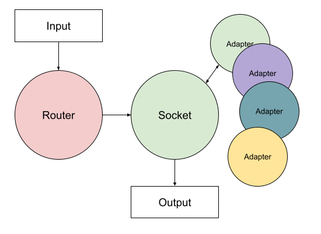

# Mixture of dynamically connected adapters (MoDA)

Mixture of Dynamically Connected Adapters (MoDA) is a framework designed to enhance the performance and flexibility of
large language models by dynamically selecting and integrating specialized adapters based on the input query. This
project facilitates seamless integration and execution of various adapters to optimize responses for different types of
queries.

[Русский](./README.md) | **English**



## Features

* **Dynamic Adapter Selection** - automatically selects the most appropriate adapter based on the
  input query conditions.
* **Multiple Adapter Integration** - supports multiple adapters with distinct functionalities, such
  as language-specific or domain-specific tasks.
* **Efficient Resource Utilization** - leverages efficient models and techniques like loading
  models in 8-bit to save computational resources.
* **Extensible Framework** - easily add and configure new adapters via a YAML configuration file.

## Configuration

MoDA uses a `config.yml` file to specify the models and adapters. Below is the schema for the configuration file.

```yaml
caller:
  name: <model_name>
  load_in_8bit: <True/False>

socket:
  name: <model_name>
  load_in_8bit: <True/False>

functions:
  - name: <adapter_name>
    prompt: <system_prompt>
    description: <description>
    condition: <condition_for_using_adapter>
    chat_template: <chat_template>
```

For a full example, refer to the [config.yml](./config.yml) file located in the root of this repository.

## Usage

To understand how to use MoDA, refer to the [moda.ipynb](./moda.ipynb) Jupyter notebook in the root of this repository.
This notebook provides a comprehensive example of loading models, initializing a conversation, handling function calls,
and dynamically switching between different adapters to process user queries efficiently.

## License

This project is licensed under the MIT License. See the [LICENSE](./LICENSE) file for details.
