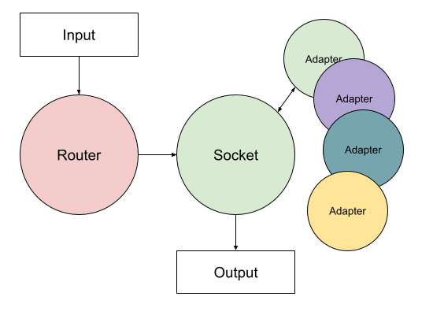

# Mixture of dynamically connected adapters (MoDA)

Смесь Динамически Подключаемых Адаптеров (Mixture of dynamically connected adapters или просто MoDA) — это фреймворк,
разработанный для повышения производительности и гибкости крупных языковых моделей за счет динамического выбора и
интеграции специализированных адаптеров на основе входного запроса. Этот проект облегчает бесшовную интеграцию и
выполнение различных адаптеров для оптимизации ответов на разные типы запросов.

**Русский** | [English](./README.en.md)



## Особенности

* **Динамический выбор адаптеров** - на входе у системы стоит модель способная выполнять function call (router),
  благодаря этому система самостоятельно выбирает наиболее подходящий адаптер в зависимости от условий входного запроса;
* **Интеграция нескольких адаптеров** - ведомая модель (socket) поддерживает возможность переключения на несколько
  адаптеров с
  различными функциями, такими как языковые (language specific) или доменные (domain specific) задачи;
* **Эффективное использование ресурсов** - предусмотрена поддержка `bitsnadbytes` для загрузки моделей в 8-битном
  формате, для экономии вычислительных ресурсов;
* **Расширяемый фреймворк** - легко добавить и настроить новые адаптеры через YAML-конфиг.

## Конфигурация

MoDA использует файл `config.yml` для указания моделей и адаптеров. Ниже представлена схема конфигурационного файла.

```yaml
caller:
  name: <model_name>
  load_in_8bit: <True/False>

socket:
  name: <model_name>
  load_in_8bit: <True/False>

functions:
  - name: <adapter_name>
    prompt: <system_prompt>
    description: <description>
    condition: <condition_for_using_adapter>
    chat_template: <chat_template>
```

Полный пример можно найти в файле [config.yml](./config.yml), расположенном в корне этого репозитория.

## Использование

To understand how to use MoDA, refer to the [moda.ipynb](./moda.ipynb) Jupyter notebook in the root of this repository.
This notebook provides a comprehensive example of loading models, initializing a conversation, handling function calls,
and dynamically switching between different adapters to process user queries efficiently.

Для того чтобы понять, как использовать MoDA, обратитесь к Jupyter-блокноту [moda.ipynb](./moda.ipynb), что в корне
репозитория. Этот ноутбук предоставляет исчерпывающий пример загрузки моделей, инициализации разговора,
обработки вызовов функций и динамического переключения между различными адаптерами для эффективной обработки
пользовательских запросов.

## Лицензия

Этот проект лицензирован под лицензией `MIT`. Подробности см. в файле [LICENSE](./LICENSE).

## Цитирование

```

@misc{moda2024sources,
    title={Mixture of dynamically connected adapters (MoDA)}, 
    author={Pavel Rykov},
    year={2024}
}
```
